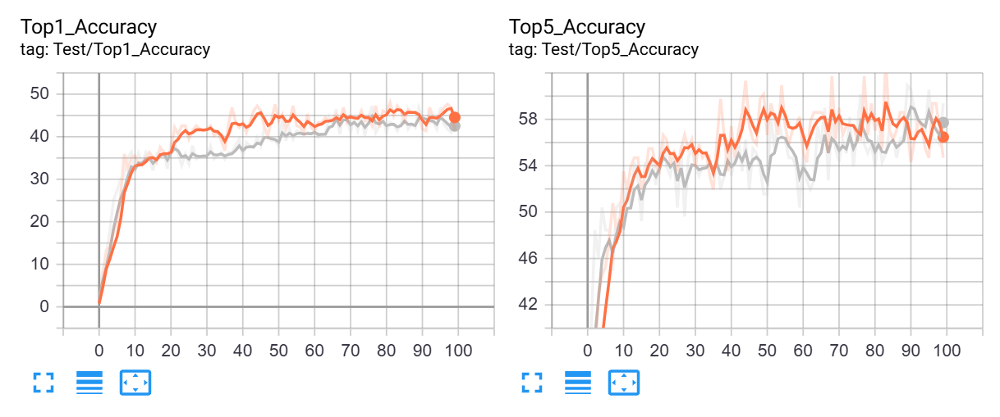

# PyTorch SimCLR: A Simple Framework for Contrastive Learning of Visual Representations
[](https://zenodo.org/badge/latestdoi/241184407)


### Blog post with full documentation: [Exploring SimCLR: A Simple Framework for Contrastive Learning of Visual Representations](https://sthalles.github.io/simple-self-supervised-learning/)


### See also [PyTorch Implementation for BYOL - Bootstrap Your Own Latent: A New Approach to Self-Supervised Learning](https://github.com/sthalles/PyTorch-BYOL).

## Installation

```
$ conda create --name simclr python=3.7
$ conda activate simclr
$ conda install pytorch==1.12.1 torchvision==0.13.1 torchaudio==0.12.1 cudatoolkit=11.3 -c pytorch
$ pip install -r requirements.txt
```

## Dataset Generation

The original input dataset can be downloaded from [Firefighting schematics](https://universe.roboflow.com/yaid-pzikt/firefighting-device-detection/dataset/6). Please download the coc format version for compatibility. This data needs to be modified to bring into the training format.
Both the input data and converted data for firefighting devices has been downloaded, pregenerated and saved in the datasets directory as ff_devices and ff_devices_individual respectively, along with the trained checkpoints [Link to Drive](https://drive.google.com/drive/folders/10mmwIRmeUgIU4QU1-q4NnE97uGpS1JrI?usp=sharing). If required, it can be regenerated using:

```
$ python data_gen/gen_data_from_schematics.py
```

The above script takes the full schematic images containing symbols as input and extracts the individual images using the labeled bounding boxes to create the contrastive learniong dataset. The input dataset structure should follow the roboflow format. The output data follows similar format but each train/test/valid have subfolders named by their class, each having all the symbol images belonging to the same class. This allows easy training infrastructure for both unsupervised contrastive training and linear classifier after extracting features.
### Input Dataset Structure

The input dataset should follow the Roboflow format:

```
datasets/
└── ff_devices/
    ├── train/
    │   ├── _annotations.coco.json
    │   ├── image1.jpg
    │   ├── image2.jpg
    │   └── ...
    ├── valid/
    │   ├── _annotations.coco.json
    │   ├── image1.jpg
    │   ├── image2.jpg
    │   └── ...
    └── test/
        ├── _annotations.coco.json
        ├── image1.jpg
        ├── image2.jpg
        └── ...
```

### Output Dataset Structure

The output dataset will have a similar format but with subfolders named by their class:

```
datasets/
└── ff_devices_individual/
    ├── train/
    │   ├── class1/
    │   │   ├── image1.jpg
    │   │   ├── image2.jpg
    │   │   └── ...
    │   ├── class2/
    │   │   ├── image1.jpg
    │   │   ├── image2.jpg
    │   │   └── ...
    │   └── ...
    ├── valid/
    │   ├── class1/
    │   │   ├── image1.jpg
    │   │   ├── image2.jpg
    │   │   └── ...
    │   ├── class2/
    │   │   ├── image1.jpg
    │   │   ├── image2.jpg
    │   │   └── ...
    │   └── ...
    └── test/
        ├── class1/
        │   ├── image1.jpg
        │   ├── image2.jpg
        │   └── ...
        ├── class2/
        │   ├── image1.jpg
        │   ├── image2.jpg
        │   └── ...
        └── ...
```


## Config file

Before running SimCLR, make sure you choose the correct running configurations. You can change the running configurations by passing keyword arguments to the ```run.py``` file.

```python

$ python run.py -data ./datasets/ff_devices_individual/train -dataset-name ff_devices_one_shot -b 32 --epochs 200 --log-every-n-steps 10 

```

If you want to run it on CPU (for debugging purposes) use the ```--disable-cuda``` option.

For 16-bit precision GPU training, there **NO** need to to install [NVIDIA apex](https://github.com/NVIDIA/apex). Just use the ```--fp16_precision``` flag and this implementation will use [Pytorch built in AMP training](https://pytorch.org/docs/stable/notes/amp_examples.html).

NOTE: Pretrained checkpoint is already trained and stored in checkpoints directory

To visualize results during training run
```
tensorboard --logdir "./runs"
```

## Feature Evaluation

Feature evaluation is done using a linear model protocol. This has been modified to work with the firefighting devices data

First, we learned features using SimCLR on the ```ff_devices_individual train``` set. Then, we train a linear classifier on top of the frozen features from SimCLR. The linear model is trained on features extracted from the ```ff_devices_individual valid``` set and evaluated on the ```ff_devices_individual test``` set. 

To run the linear classifier model training
```python

$ python feature_eval/linear_classifier.py --train_dataset_name ./datasets/ff_devices_individual/valid --test_dataset_name ./datasets/ff_devices_individual/test --checkpoint_path ./checkpoints/one_shot_with_aug/checkpoint_0200.pth.tar

```

Note that SimCLR benefits from **longer training**.

| Linear Classification      | Dataset              | Feature Extractor | Architecture                                                                    | Feature dimensionality | Projection Head dimensionality | Epochs | Top1 % |
|----------------------------|----------------------|-------------------|---------------------------------------------------------------------------------|------------------------|--------------------------------|--------|--------|
| Logistic Regression (Adam) | STL10                | SimCLR            | [ResNet-18](https://drive.google.com/open?id=14_nH2FkyKbt61cieQDiSbBVNP8-gtwgF) | 512                    | 128                            | 100    | 74.45  |
| Logistic Regression (Adam) | CIFAR10              | SimCLR            | [ResNet-18](https://drive.google.com/open?id=1lc2aoVtrAetGn0PnTkOyFzPCIucOJq7C) | 512                    | 128                            | 100    | 69.82  |
| Logistic Regression (Adam) | STL10                | SimCLR            | [ResNet-50](https://drive.google.com/open?id=1ByTKAUsdm_X7tLcii6oAEl5qFRqRMZSu) | 2048                   | 128                            | 50     | 70.075 |
| Logistic Regression (Adam) | ff_devices_unlabeled | SimCLR            | [ResNet-18](https://drive.google.com/open?id=14_nH2FkyKbt61cieQDiSbBVNP8-gtwgF) | 512                    | 128                            | 100    | 41.41  |
| Logistic Regression (Adam) | ff_devices_one_shot  | SimCLR            | [ResNet-18](https://drive.google.com/open?id=14_nH2FkyKbt61cieQDiSbBVNP8-gtwgF) | 512                    | 128                            | 100     | 42.97  |

## Analysis for linear classification

Two feature extractor models were used, one using multishot data and another using single shot for all 40 classes. The trained linear classfier on their feature extraction performed as shown in the figure. Grey is one shot, orange is multi-shot.



